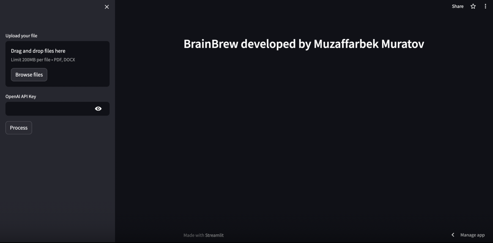

# Creating a Chatbot with Streamlit LangChain and OpenAI

Chat application that seamlessly integrates PDF/Docx interaction and the power of OpenAI's language model and LangChain. With this, you can engage in natural and intuitive conversations with your study materials on canvas, making information retrieval, analysis, and collaboration easier than ever before.

# In the future

I'm planning to add flashcards and quizzes to be better prepared for exams.

## LANGCHAIN

LangChain serves as a foundational framework for crafting applications driven by language models.

## Streamlit

With Streamlit, it takes just a matter of minutes to construct and launch robust data applications, allowing for swift and efficient development and deployment.

Sorry, I'm too lazy to build frontend :)))

## Installation

1. Clone the repository:
   `gh repo clone Muzaffarbekm/BrainBrew`

2. Install requirement file.

3. Start the Streamlit app.
